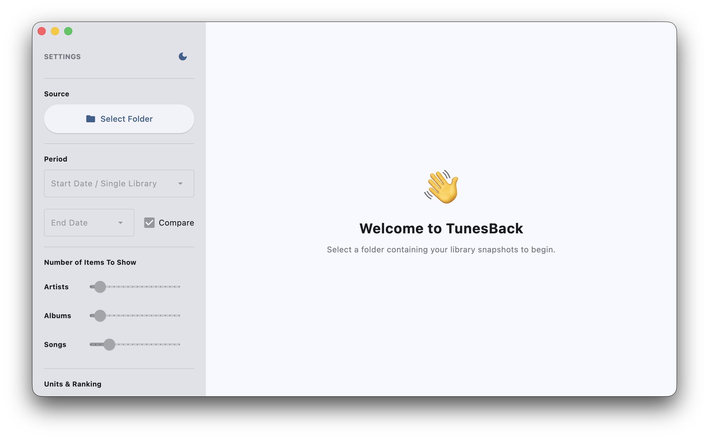
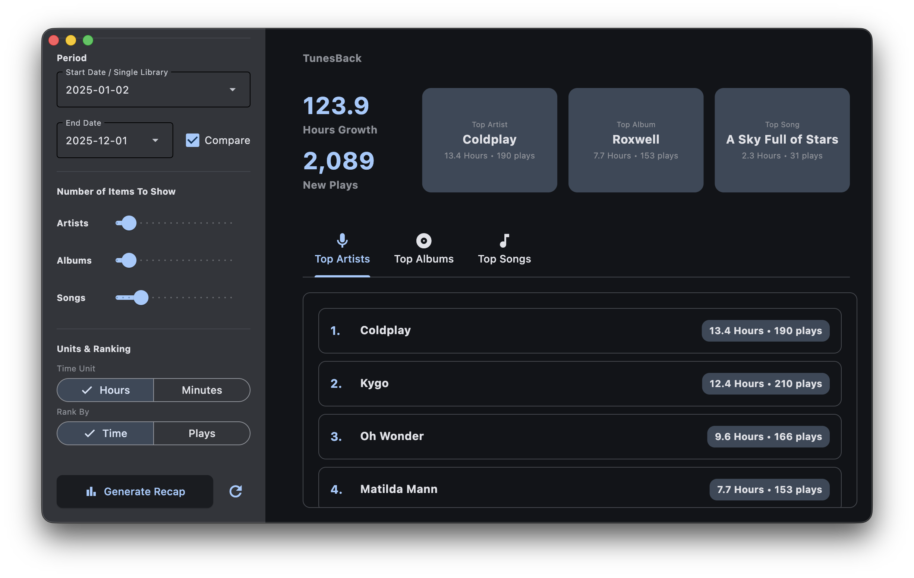

<div align="center">
  
  
# **TunesBack**

**The replay statistics for the rest of us.**

*Year-in-review for iTunes and iPod users.*

  [](https://www.gnu.org/licenses/gpl-3.0)
  

</div>

<div align="center">
  <table>
    <tr>
      <td width="33%" align="center">
        
        <br/><sub><b>Welcome Screen</b></sub>
      </td>
      <td width="33%" align="center">
        
        <br/><sub><b>Main Dashboard</b></sub>
      </td>
    </tr>
  </table>
</div>

## Why TunesBack?

Spotify has Wrapped. Apple Music has Replay. But what about iTunes and iPod users?

TunesBack brings year-end analytics to your local music library. Track your listening habits, see your top artists, albums and songs, and discover how your taste evolves over time.

Works with iTunes and Apple Music libraries on **Windows, macOS, and Linux**.

Powered by [libpytunes](https://github.com/liamks/libpytunes) for iTunes XML parsing.

## Features

- **Compare periods** or analyze single snapshots (XML files must be properly named — see guide below)
- **Top Artists, Albums & Songs** with customizable rankings (5–100 items)
- Sort with **Genres, New Finds, Skipped Tracks & Years**
- **Album art** displayed alongside track details
- **Wrapped cards:** shareable Spotify-style visual summaries
- **Listening Age:** calculates the "era" of music you gravitate toward
- **Flexible display:** switch between hours/minutes, sort by time or plays
- **Dark and light mode**
- **Fully offline:** all processing happens on your machine

## Wrapped Cards

Generate shareable images summarizing your listening habits.

<div align="center">
  <table>
    <tr>
      <td align="center"></td>
      <td align="center"></td>
      <td align="center"></td>
      <td align="center"></td>
    </tr>
    <tr>
      <td align="center"></td>
      <td align="center"></td>
      <td align="center"></td>
      <td align="center"></td>
    </tr>
  </table>
</div>

**Available cards:**
- **Top Songs & Albums** — ranked lists with album artwork
- **Top Genres** — typographic genre tiles
- **Top Song** — hero card with large cover art
- **Minutes Listened** — total listening time
- **Listening Age** — your calculated musical age
- **Summary** — overview combining top artist, stats, and genres

The order of items follows the "Ranked By" setting. Re-generate after changing the ranking.

> More card types to come!

## Listening Age

This metric estimates the "age" of your music taste using your library's metadata.

<div align="center">
  
</div>

The calculation is based on the "reminiscence bump" — the idea that people form the strongest connections to music discovered in their late teens.

1. **Aggregate** — Group play counts by each track's release year
2. **Find the peak** — Identify the 5-year window with the highest listening density
3. **Assume formative age** — Treat the midpoint of that window as age 18
4. **Project** — Calculate the difference from the current year

*Example: If most of your listening falls between 2010 and 2015, the midpoint is around 2012. Assuming you were 18 then, your Listening Age in 2025 would be about 31.*

## Quick Start

### 1. Run TunesBack

**Download from** [Releases](https://github.com/mooseses/TunesBack/releases)

| Platform | Format |
|----------|--------|
| Windows | Installer (`.exe`) |
| macOS | Disk image (`.dmg`) |

> **macOS:** You may need to go to **System Settings → Privacy & Security** and click "Open Anyway" the first time.

### Linux

Linux users should run from source:

```bash
git clone https://github.com/mooseses/TunesBack.git
cd TunesBack
python3 -m venv venv
source venv/bin/activate
pip install -r requirements.txt
python main.py
```

**Requirements:** Python 3.10+

**Or run from source on any platform:**

```bash
git clone https://github.com/mooseses/TunesBack.git
cd TunesBack
pip install -r requirements.txt
python main.py
```

### 2. Export Your Library

1. In iTunes or Music, go to **File → Library → Export Library**
2. Save the file with a date in the name (e.g., `2025-12-01.xml`)
3. Export again later to compare snapshots

### 3. Analyze

1. Click **Select Folder** and point to your XML files
2. Choose a date range or a single snapshot
3. Click **Generate Recap**
4. Use the pencil icon to show or hide tabs
5. Click **Generate Wrapped** to create shareable cards

## File Naming

TunesBack extracts dates from filenames automatically. It displays them as `YYYY-MM-DD` in the app.

### Recommended formats

```
2025-12-01.xml
2025_12_01.xml
December-01-2025.xml
Dec-01-2025.xml
01 December 2025.xml
2025-12-01 iTunes Library.xml
Library_2025_12_01_backup.xml
```

Use ISO format (`YYYY-MM-DD.xml`) or include the month name to avoid ambiguity.

### These won't work reliably

- `library.xml` — no date
- `v2.1.3-export.xml` — version numbers get confused with dates
- `backup.xml` — no date
- `01-12-2025.xml` — could be January 12 or December 1
- `12-01-2025.xml` — same issue

### Automating exports

You can schedule a task to copy your library XML to a snapshots folder:

**macOS/Linux (cron):**

```bash
# Monthly on the 1st at midnight
0 0 1 * * cp ~/Music/iTunes/iTunes\ Library.xml ~/Music/Snapshots/$(date +\%Y-\%m-\%d).xml
```

**Windows (PowerShell via Task Scheduler):**

```powershell
$date = Get-Date -Format "yyyy-MM-dd"
Copy-Item "$env:USERPROFILE\Music\iTunes\iTunes Library.xml" "$env:USERPROFILE\Music\Snapshots\$date.xml"
```

## Known Limitations

- **Album art** is extracted from embedded tags. iTunes' "Get Album Art" feature stores artwork separately and won't be picked up.
- **Moved libraries** — if your music files have moved and the XML paths are outdated, artwork won't load. Enable debug logging to investigate.
- **Network shares** — path resolution works best when shares are already mounted.
- **CJK text** — font fallback for Asian characters in Wrapped cards is limited.

Enable "Debug Logging" in the app to see why artwork might be missing.

## Tech Stack

- [Flet](https://flet.dev/) — Python UI framework
- [libpytunes](https://github.com/liamks/libpytunes) — iTunes XML parser
- [pandas](https://pandas.pydata.org/) — data analysis
- [Pillow](https://pillow.readthedocs.io/) — image generation
- [mutagen](https://mutagen.readthedocs.io/) — audio metadata extraction
- [python-dateutil](https://dateutil.readthedocs.io/) — date parsing

## Feedback

Found a bug or have a suggestion? [Open an issue](https://github.com/mooseses/TunesBack/issues/new).

## License

GPL-3.0. See `LICENSE` for details.
