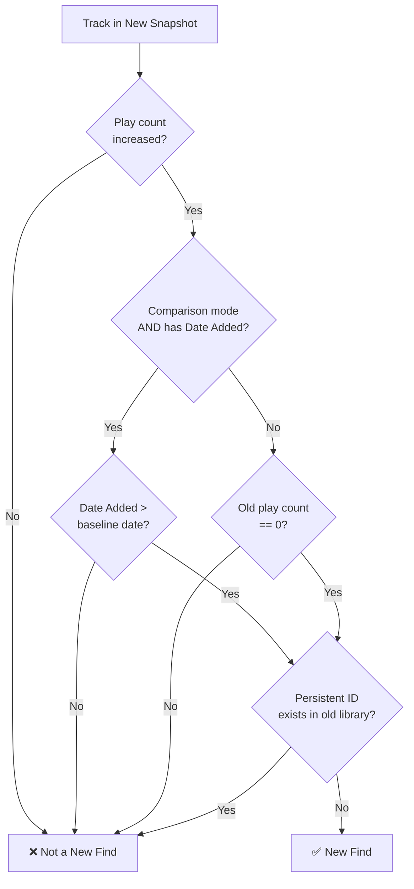

<div align="center">
  
  
# **TunesBack**

**The replay statistics for the rest of us.**

*Year-in-review for iTunes and iPod users.*

  [](https://www.gnu.org/licenses/gpl-3.0)
  

</div>

<div align="center">
  
  
</div>
<div align="center">
  <em>TunesBack App - Welcome Screen and Main Dashboard</em>
</div>

## Why TunesBack?

Spotify has Wrapped. Apple Music has Replay. But what about iTunes and iPod users?

TunesBack brings year-end analytics to your local music library. Track your listening habits, see your top artists, albums and songs, and discover how your taste evolves over time.

Works with iTunes and Apple Music libraries on **Windows, macOS, and Linux**.

Powered by [libpytunes](https://github.com/liamks/libpytunes) for iTunes XML parsing.

## Features

- **Compare periods** or analyze single snapshots (XML files must be properly named: see guide below)
- **Top Artists, Albums & Songs** with customizable rankings (5–100 items)
- Sort with **Genres, New Finds, Skipped Tracks & Years**
- **Album art** displayed alongside track details
- **Network share support**: seamlessly works with UNC paths (Windows) and GVFS/CIFS mounts (Linux)
- **Wrapped cards:** shareable Spotify-style visual summaries
- **Listening Age:** calculates the "era" of music you gravitate toward
- **Flexible display:** switch between hours/minutes, sort by time or plays
- **Dark and light mode**
- **Fully offline:** all processing happens on your machine

## Wrapped Cards

Generate shareable images summarizing your listening habits.

<p align="center">
  
  
  
  
</p>

<p align="center">
  
  
  
</p>

**Available cards:**
- **Top Songs & Albums**: ranked lists with album artwork
- **Top Genres**: typographic genre tiles
- **Top Song**: hero card with large cover art
- **Minutes Listened**: total listening time
- **Listening Age**: your calculated musical age
- **Summary**: overview combining top artist, stats, and genres

The order of items follows the "Ranked By" setting. Re-generate after changing the ranking.

> More card types to come!

## Listening Age

TunesBack computes a single-number summary called the "Listening Age" to describe the era that most strongly characterizes your listening habits. The metric is inspired by the psychological "reminiscence bump", which is the tendency for music encountered during one's formative years to retain stronger emotional significance.

The following chart explains its methodology:

<div align="center">
  
<br/>
  <em>Listening Age Algorithm</em>
</div>


#### How the metric is calculated (algorithmic summary):

- Aggregate play counts by each track's release year.
- Slide a 5-year window across the years in your data and compute the total plays for each window.
- Select the 5-year window with the highest total plays (the "peak era").
- Take the center year of that window and assume the listener was 18 at that midpoint.
- Calculate Listening Age as: current year − (midpoint year − 18).

Formula:

```
Listening Age = Current Year - (Peak Era Midpoint - 18)
```

Example:

- Peak window: 2010–2014 → midpoint 2012
- Assumed birth year: 2012 − 18 = 1994
- Listening Age (in 2025): 2025 − 1994 = 31

Notes and interpretation:

- A Listening Age lower than your chronological age indicates a preference for more recent releases.
- A Listening Age higher than your chronological age indicates a preference for older material.
- The method uses a fixed 5-year window and a formative age constant of 18; these parameters reflect a balance between sensitivity and robustness in typical music libraries.

Implementation details: the algorithm (see `listening_age_algorithm.py`) filters out invalid years, sums plays per year, evaluates every 5-year window, selects the highest-sum window, and computes the final age as shown above.

## New Music Finding

TunesBack uses a multi-stage validation process to accurately identify genuinely new additions to your library, distinguishing them from tracks whose metadata has been edited and pre-existing tracks that were simply unplayed.

### Classification Criteria

When comparing two library snapshots, a track qualifies as a **New Find** only if **all** of the following conditions are met:

1. **Play Count Increase**: The track shows increased play activity (`diff_count > 0`) in the more recent snapshot.
2. **No Persistent ID Match**: The track's unique identifier (Persistent ID) does not exist in the baseline library, this confirms it wasn't already present.
3. **Date Added Verification** (comparison mode): If a baseline date exists, the track's `Date Added` timestamp must fall after that date.

#### Single Snapshot Mode

When analyzing a single library export (no baseline for comparison), a track is classified as a "New Find" if:
- It has at least one play (`count > 0`)
- No matching Persistent ID exists from a previous reference (i.e., no prior play history)

### Why Persistent ID?

iTunes assigns each track a unique **Persistent ID** that remains constant even if the file is renamed, moved, or re-tagged. By checking for ID matches between snapshots, TunesBack can:
- Detect tracks whose metadata has been edited
- Avoid false positives from tracks that existed but were never played
- Accurately track genuinely new library additions

### Decision Flow



### Algorithm Summary

```
IF play_count_increased THEN
    IF comparison_mode AND has_date_added THEN
        new_find = (date_added > baseline_date) AND (no_persistent_id_match)
    ELSE
        new_find = (old_play_count == 0) AND (no_persistent_id_match)
```

Implementation details: see the `calculate_diff()` and `process_stats()` methods in `main.py`.

## Album Art & Network Share Support

TunesBack extracts album artwork directly from your audio files using **embedded metadata tags** and features **intelligent path resolution for network shares**. This ensures artwork displays even when files are stored on remote servers or have been moved.

### How it works

1. **Direct extraction**: Uses [Mutagen](https://mutagen.readthedocs.io/) to read embedded artwork from audio file tags (ID3, MP4, FLAC, etc.)
2. **Smart path resolution for network shares**: Automatically handles:
   - **Windows UNC paths**: Converts `file://server/share/...` to `\\server\share\...`
   - **Linux GNOME/GVFS**: Auto-detects mounts at `/run/user/<uid>/gvfs/smb-share:...`
   - **Linux KDE/kio-fuse**: Auto-detects Dolphin mounts at `/run/user/<uid>/kio-fuse-*/smb/...`
   - **macOS network volumes**: Resolves `/Volumes/...` paths
   - **Hostname ↔ IP resolution**: Works even when XML uses hostname but mount uses IP
   - **Moved files**: Works as long as the new path is accessible
3. **No configuration needed**: Network paths are resolved automatically across all platforms


### Troubleshooting missing artwork

If album art doesn't appear:

1. **Enable Debug Logging** in the app settings
2. Check the log file for path resolution errors:
   - **macOS:** `~/Library/Logs/TunesBack/tunesback.log`
   - **Windows:** `%LOCALAPPDATA%\TunesBack\Logs\tunesback.log`
   - **Linux:** `~/.cache/TunesBack/logs/tunesback.log`
3. Verify your audio files have embedded artwork:
   ```bash
   # macOS/Linux
   ffprobe -v error -show_entries format_tags=title -of default=noprint_wrappers=1 "song.mp3"
   
   # Or use any audio tagger to check
   ```
4. For network shares, ensure they're mounted before starting TunesBack

### Network share setup

**Windows:**
- Map network drive or use UNC paths directly
- XML paths like `file://server/share/Music/...` are automatically converted

**Linux:**
- **KDE/Dolphin**: Simply browse to the network share in Dolphin before launching TunesBack
- **GNOME/Nautilus**: Connect via Files → Other Locations → Connect to Server
- **Manual mount**:
  ```bash
  sudo mount -t cifs //server/share /mnt/music -o username=user
  ```


## Quick Start

### 1. Run TunesBack

**Download from** [Releases](https://github.com/mooseses/TunesBack/releases)

| Platform | Format |
|----------|--------|
| Windows | Installer (`.exe`) |
| macOS | Disk image (`.dmg`) |

> **macOS:** You may need to go to **System Settings → Privacy & Security** and click "Open Anyway" the first time.

### Linux

Linux users should run from source:

```bash
git clone https://github.com/mooseses/TunesBack.git
cd TunesBack
python3 -m venv venv
source venv/bin/activate
pip install -r requirements.txt
python main.py
```

**Requirements:** Python 3.10+

**Or run from source on any platform:**

```bash
git clone https://github.com/mooseses/TunesBack.git
cd TunesBack
pip install -r requirements.txt
python main.py
```

### 2. Export Your Library

1. In iTunes or Music, go to **File → Library → Export Library**
2. Save the file with a date in the name (e.g., `2025-12-01.xml`)
3. Export again later to compare snapshots

### 3. Analyze

1. Click **Select Folder** and point to your XML files
2. Choose a date range or a single snapshot
3. Click **Generate Recap**
4. Use the pencil icon to show or hide tabs
5. Click **Generate Wrapped** to create shareable cards

## File Naming

TunesBack extracts dates from filenames automatically. It displays them as `YYYY-MM-DD` in the app.

### Recommended formats

```
2025-12-01.xml
2025_12_01.xml
December-01-2025.xml
Dec-01-2025.xml
01 December 2025.xml
2025-12-01 iTunes Library.xml
Library_2025_12_01_backup.xml
```

Use ISO format (`YYYY-MM-DD.xml`) or include the month name to avoid ambiguity.

### These won't work reliably

- `library.xml`: no date
- `v2.1.3-export.xml`: version numbers get confused with dates
- `backup.xml`: no date
- `01-12-2025.xml`: could be January 12 or December 1
- `12-01-2025.xml`: same issue

### Automating exports

You can schedule a task to copy your library XML to a snapshots folder:

**macOS/Linux (cron):**

```bash
# Monthly on the 1st at midnight
0 0 1 * * cp ~/Music/iTunes/iTunes\ Library.xml ~/Music/Snapshots/$(date +\%Y-\%m-\%d).xml
```

**Windows (PowerShell via Task Scheduler):**

```powershell
$date = Get-Date -Format "yyyy-MM-dd"
Copy-Item "$env:USERPROFILE\Music\iTunes\iTunes Library.xml" "$env:USERPROFILE\Music\Snapshots\$date.xml"
```

## Known Limitations

- **Album art** is extracted from embedded tags. iTunes' "Get Album Art" feature stores artwork separately and won't be picked up.
- **Moved libraries**: if your music files have moved and the XML paths are outdated, artwork won't load. Enable debug logging to investigate.
- **Network shares**: path resolution works best when shares are already mounted.
- **CJK text**: font fallback for Asian characters in Wrapped cards is limited.

Enable "Debug Logging" in the app to see why artwork might be missing.

## Tech Stack

- [Flet](https://flet.dev/): Python UI framework
- [libpytunes](https://github.com/liamks/libpytunes): iTunes XML parser
- [pandas](https://pandas.pydata.org/): data analysis
- [Pillow](https://pillow.readthedocs.io/): image generation
- [mutagen](https://mutagen.readthedocs.io/): audio metadata extraction
- [python-dateutil](https://dateutil.readthedocs.io/): date parsing

## Feedback

Found a bug or have a suggestion? [Open an issue](https://github.com/mooseses/TunesBack/issues/new).

## License

GPL-3.0. See `LICENSE` for details.
