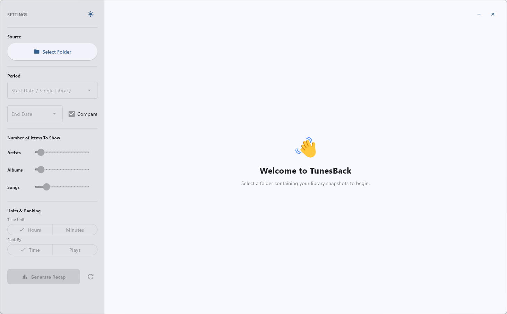

<div align="center">
  
  
# 🎵 TunesBack

**Your music story, beautifully analyzed.**

*The "Apple Music Replay" experience for iTunes and iPod users.*

  [](https://www.gnu.org/licenses/gpl-3.0)

</div>

<div align="center">
  <table>
    <tr>
      <td width="33%" align="center">
        
        <br/><sub><b>Welcome Screen</b></sub>
      </td>
      <td width="33%" align="center">
        
        <br/><sub><b>Main Dashboard</b></sub>
      </td>
    </tr>
  </table>
</div>

## Why TunesBack?

Spotify has Wrapped. Apple Music has Replay. But what about iTunes and iPod users?

**TunesBack fills that gap.** Streaming services provide year-end analytics, but local music libraries don't... until now. TunesBack brings that experience to your local library: track listening habits, discover top artists, albums and songs, and see how your taste evolves over time.

Works with both iTunes and Apple Music libraries. Cross-platform support for Windows, macOS, and Linux. (WIP)

Powered by [libpytunes](https://github.com/liamks/libpytunes) for robust iTunes XML parsing.

## ✨ Features

- **Compare periods** or analyze single snapshots (XML files be properly named. See guide below)
- **Top Artists, Albums & Songs** with customizable rankings (5-100 items)
- **Flexible display**: Hours/minutes, sort by time/plays
- **Beautiful dashboard** with dark/light mode
- **100% private**: All processing happens locally on your machine

## 🚀 Quick Start

### 1. Install

**Pre-built app** (recommended): Download from [Releases](https://github.com/mooseses/TunesBack/releases)

**From source**:
```bash
git clone https://github.com/mooseses/TunesBack.git
cd TunesBack

pip install -r requirements.txt

python tunesback.py
```

Alternatively, install dependencies manually:
```bash
pip install flet libpytunes pandas python-dateutil
python tunesback.py
```

### 2. Export Your Library

1. Open iTunes/Music → **File** → **Library** → **Export Library**
2. Save as `.xml` with a date in filename (e.g., `2025-12-01.xml`)
3. Export again later to compare!

### 3. Analyze

1. Click **Select Folder** and choose your XML files location
2. Pick date range or single snapshot
3. Click **Generate Recap**

## 📁 File Naming Guide

**How TunesBack Parses Dates**

TunesBack uses **fuzzy date parsing** to automatically extract dates from your XML filenames. The parser looks for date-like patterns anywhere in the filename and standardizes them to `YYYY-MM-DD` format in the app.

**Recommended Formats (Unambiguous):**
- `2025-12-01.xml` or `2025-12-01 iTunes Library.xml`
- `2025_12_01.xml`
- `December 01 2025.xml` or `Dec 01 2025.xml`
- `01 December 2025.xml`
- `2025-December-01.xml`

**Date Format Ambiguity Warning**

Be careful with numeric-only dates! The parser may interpret them differently based on your system:

- `01-12-2025.xml` could be:
  - **January 12, 2025** (MM-DD-YYYY format)
  - **December 1, 2025** (DD-MM-YYYY format)

- `12-01-2025.xml` could be:
  - **December 1, 2025** (MM-DD-YYYY format)
  - **January 12, 2025** (DD-MM-YYYY format)

**Best Practice:** Use ISO format `YYYY-MM-DD.xml` or include month names like `December-01-2025.xml` to avoid confusion.

**Examples that work:**
- `2025-12-01.xml`
- `iTunes Export December 2025.xml`
- `Library_2025_12_01_backup.xml`

**Examples that might fail:**
- `library.xml` (no date)
- `v2.1.3-export.xml` (version numbers confused with dates)

### Pro Tip: Automate Your Exports!

Instead of manually exporting, set up a scheduled task to automatically copy and rename `iTunes Library.xml` to a dedicated snapshots folder each month/week/day. You can do this entirely on the cloud if you're already using iTunes Library XML parsers like [this one](https://gist.github.com/ddelange/46d5a4c8c9897abb0d3d407938d3702a) to sync your playlists to services like Plex.


## 🛠️ Built With

- [Flet](https://flet.dev/) - Python UI framework
- [libpytunes](https://github.com/liamks/libpytunes) - iTunes XML parser
- [pandas](https://pandas.pydata.org/) - Data analysis
- [python-dateutil](https://dateutil.readthedocs.io/) - Date parsing

## License

Distributed under the GPL-3.0 License. See `LICENSE` for details.
